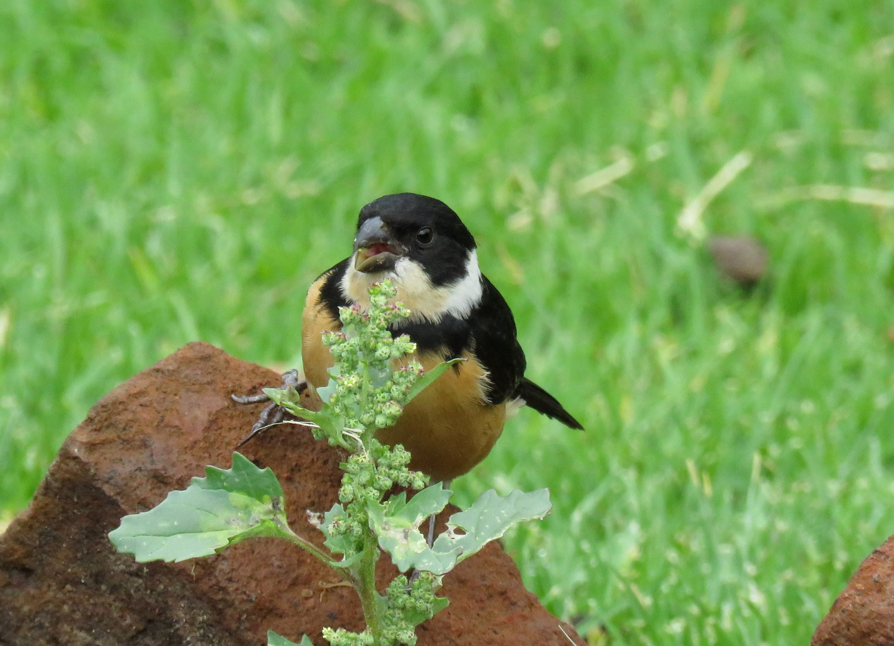

# Acerca del autor.

Mi nombre es Fernando Dorantes Nieto y soy biólogo egresado
de la [BUAP](http://www.buap.mx/).
Me encanta la observación de aves, soy un orgulloso
miembro del grupo [Alas urbanas](https://alasurbanaspuebla.wordpress.com/)
club de observadores de la ciudad de Puebla.
Soy también muy autodidacta y me gusta mucho la programación
científica.

Soy fan de los siguientes lenguajes:
  * R
  * Python
  * Javascript
  * Julia
  * Octave
  * Latex

Mi objetivo a corto plazo es dominar los lenguajes C, C++ y Scala.
Además de dominar el "Aprendizaje automático" ya sean
redes neurales, máquinas de vectores de soporte y todas esas cosas locas
de la "inteligencia artificial".

Si quieres saber que proyectos tengo, visita
mi perfil de [GitHub](https://github.com/FerDoranNie)

Si deseas conversar y tienes proyectos con los cuales colaborar
no dudes mandar correo a **fertimjim@gmail.com**.

## Semillero de collar (*sporophila torqueola*), foto de Ariadna Tobón:

